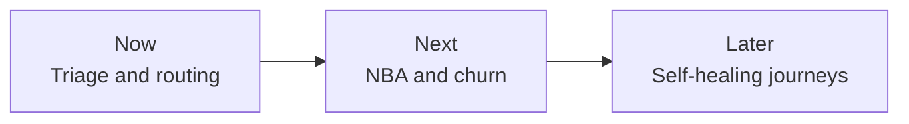
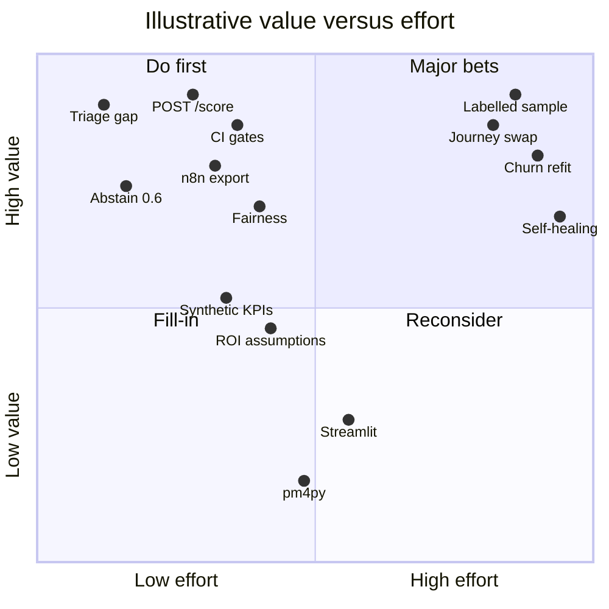

# Digital care roadmap

Which care-analytics capability should a telco build first, and how would you know it worked?

A Now / Next / Later product roadmap that sequences the four earlier projects, with OKRs as goals and a value-versus-effort backlog of 17 issues (#3 to #19), two sprint plans and a pilot charter. Part of an independent portfolio series on telecom customer analytics, built alongside my MSc in Data Science. It builds on the CRISP-DM projects in the series.

## Key results (capability and scope)

- 3 horizons: Now (triage and routing), Next (NBA and churn), Later (self-healing journeys).
- 17 backlog items (3 epics, 14 stories) scored on value vs effort, 1 to 5 scale.
- OKR targets and scores are illustrative planning values, not achieved results.

## Now, Next, Later

`scripts/render_roadmap.py` draws that image. The same sequence in text:

### Now - Triage and routing

Demo, today:

- [MULTI-HEAD-](https://github.com/ChristopherKiokoStrathmore/MULTI-HEAD-) at `809bccd61077898849c428f37521fa198f7c7bf6` is a three-head demo (issue, sentiment, urgency). Issue confidence strictly below 0.6 is held for review. The repo publishes no gold accuracy, F1, emergency recall, or false-emergency rate. Smoke floors `minEmergencyRecall` 0.01 and `maxFalseEmergencyRate` 0.99 are harness-health thresholds, not model quality. That reading is the one written in [responsible-ai-pack](https://github.com/ChristopherKiokoStrathmore/responsible-ai-pack) `MODEL_CARD_MULTIHEAD.md`.
- [care-automation-roi](https://github.com/ChristopherKiokoStrathmore/care-automation-roi) ships `workflows/n8n_emergency_escalation.json`. An `emergency` label sets `queue` to `senior_agent`. The workflow README says the file has not been imported or executed. `active` is `false`. Precision 0.40, recall 0.75, and prevalence 0.08 in `assumptions.yaml` are illustrative placeholders.

Needs operator data before this is anything but a demo: a labelled sample, and a workflow run against a real queue. Do not quote the smoke floors as accuracy.

### Next - NBA and churn

Demo, today:

- [telco-churn-nba-engine](https://github.com/ChristopherKiokoStrathmore/telco-churn-nba-engine) trains on the IBM Telco Customer Churn file, 7,043 rows, US sample. `POST /score` returns a churn probability, path contributions, a CLV proxy, add-on propensities, and a rule-based next action. On the published holdout the gradient-boosting churn model has ROC-AUC 0.846001, PR-AUC 0.656070, and top-decile lift 2.806733, against a dummy prior at ROC-AUC 0.500000. Those numbers are that holdout, not an operator result. Uptake scores are current add-on holding, not campaign response. The action table is a policy, not an uplift model.
- [responsible-ai-pack](https://github.com/ChristopherKiokoStrathmore/responsible-ai-pack) pins that repo at `21f6115931f4358ebc7cc87d9ba1f4d87fd015aa`. It recomputes the same three metrics, draws TreeSHAP plots, runs Fairlearn on gender and SeniorCitizen, and fails CI under floors 0.82, 0.63, and 2.60.

Needs operator data before anyone calls this local performance: an operator extract, a refit, and a new pin. The IBM metrics stay IBM metrics.

### Later - Self-healing journeys

What the demos actually are:

- [omnichannel-care-analytics](https://github.com/ChristopherKiokoStrathmore/omnichannel-care-analytics) computes journey KPIs on a seeded synthetic log (seed 20260929, 4,000 journeys). Charts are Plotly HTML labelled SYNTHETIC. Bitext supplies the intent taxonomy. The full Kaggle Twitter corpus was not downloaded: unauthenticated requests did not return the file, and no Kaggle credentials were used. pm4py is not used. The process view is a DuckDB directly-follows table.
- [care-automation-roi](https://github.com/ChristopherKiokoStrathmore/care-automation-roi) prices containment from `assumptions.yaml`. Every input is an illustrative placeholder. On those placeholders the base bot scenario shows payback 8.47 months and year-1 ROI 0.4175. There is no Streamlit app. The sensitivity chart is a committed PNG, `reports/charts/roi_sensitivity_tornado.png`, plus an HTML twin.

What is not built: a loop that changes a live route when a digital attempt fails. Later is that loop. The four repos do not contain it.

Needs operator data: replace `config/synthetic.yaml` and `assumptions.yaml` with operator measurements, using the swap steps those READMEs already print. Until then the rates and the payback stay synthetic or illustrative.

## OKRs

Illustrative targets. None of these is a result this portfolio has achieved on operator data.

**Objective 1. A routing note a reviewer can defend without a fake accuracy number.**

| Key result | Illustrative target | What the demos already show |
| --- | --- | --- |
| KR1 | The routing note cites "not documented" for gold accuracy, and does not cite the smoke floors as quality. | The multi-head model card already says this. |
| KR2 | An import test of the n8n file, on a non-production n8n, shows `emergency` to `senior_agent`. | The file exists. It has not been run. |
| KR3 | Precision and recall leave `assumptions.yaml` only after a labelled sample is written down. | They are still placeholders. |

**Objective 2. A next-best action with a gate in front of the score.**

| Key result | Illustrative target | What the demos already show |
| --- | --- | --- |
| KR1 | A pilot score returns churn probability, a CLV proxy, and one action from the published rule table. | `POST /score` does this for one IBM-sample customer. |
| KR2 | CI fails if holdout ROC-AUC, PR-AUC, or top-decile lift fall below 0.82, 0.63, and 2.60. | Those floors are in `gates.yaml` for the IBM artifact. |
| KR3 | A model card and the gender / SeniorCitizen table ship with the score before an agent sees it. | The pack has both, for the IBM sample only. |

**Objective 3. Journey changes follow an operator log, not a synthetic clock.**

| Key result | Illustrative target | What the demos already show |
| --- | --- | --- |
| KR1 | Time-to-first-response, repeat contact, and digital-to-call are computed on an operator log. | They are computed on the synthetic log only. |
| KR2 | Cost and containment inputs are replaced from operator sources, and the placeholder label comes off only after that swap. | The label is still on every input. |
| KR3 | A failed digital attempt changes the next route in a named pilot path. | No repo implements that change. |

## Backlog and prioritisation

Scores are illustrative planning scores for this artefact, on a 1-5 scale. They are not measured benefit and not hours. The quadrant is a reading aid for the backlog. Overlapping scores are nudged on the chart so the labels fit. The table is the score.

| Item | Issue | Value | Effort | Quadrant | Status |
| --- | --- | --- | --- | --- | --- |
| Triage quality gap | [#4](https://github.com/ChristopherKiokoStrathmore/digital-care-roadmap/issues/4) | 5 | 1 | Do first | Demo exists |
| Abstain at 0.6 | [#5](https://github.com/ChristopherKiokoStrathmore/digital-care-roadmap/issues/5) | 4 | 1 | Do first | Demo exists |
| n8n emergency branch | [#6](https://github.com/ChristopherKiokoStrathmore/digital-care-roadmap/issues/6) | 4 | 2 | Do first | Export, not run |
| POST /score | [#9](https://github.com/ChristopherKiokoStrathmore/digital-care-roadmap/issues/9) | 5 | 2 | Do first | Demo exists |
| CI gates | [#10](https://github.com/ChristopherKiokoStrathmore/digital-care-roadmap/issues/10) | 5 | 2 | Do first | Demo exists |
| Fairness table | [#11](https://github.com/ChristopherKiokoStrathmore/digital-care-roadmap/issues/11) | 4 | 2 | Do first | Demo exists |
| Synthetic journey KPIs | [#14](https://github.com/ChristopherKiokoStrathmore/digital-care-roadmap/issues/14) | 3 | 2 | Do first | Demo exists |
| Assumption ROI | [#15](https://github.com/ChristopherKiokoStrathmore/digital-care-roadmap/issues/15) | 3 | 2 | Do first | Demo exists |
| Labelled triage sample | [#7](https://github.com/ChristopherKiokoStrathmore/digital-care-roadmap/issues/7) | 5 | 5 | Major bet | Needs operator data |
| Operator churn refit | [#12](https://github.com/ChristopherKiokoStrathmore/digital-care-roadmap/issues/12) | 5 | 5 | Major bet | Needs operator data |
| Operator journey swap | [#16](https://github.com/ChristopherKiokoStrathmore/digital-care-roadmap/issues/16) | 5 | 5 | Major bet | Needs operator data |
| Self-healing loop | [#17](https://github.com/ChristopherKiokoStrathmore/digital-care-roadmap/issues/17) | 4 | 5 | Major bet | Not built |
| pm4py | [#18](https://github.com/ChristopherKiokoStrathmore/digital-care-roadmap/issues/18) | 1 | 3 | Reconsider | Declined in the journey README |
| Streamlit | [#19](https://github.com/ChristopherKiokoStrathmore/digital-care-roadmap/issues/19) | 2 | 3 | Reconsider | Declined in the ROI README |

Epics: [#3](https://github.com/ChristopherKiokoStrathmore/digital-care-roadmap/issues/3) triage, [#8](https://github.com/ChristopherKiokoStrathmore/digital-care-roadmap/issues/8) NBA and churn, [#13](https://github.com/ChristopherKiokoStrathmore/digital-care-roadmap/issues/13) self-healing journeys. The full sheet is [backlog.csv](backlog.csv).

## Pilot plan

Two sprint plans, with user stories and Given / When / Then criteria: [docs/sprint-plans.md](docs/sprint-plans.md).

Sprint 1 is the triage contract ([#4](https://github.com/ChristopherKiokoStrathmore/digital-care-roadmap/issues/4), [#5](https://github.com/ChristopherKiokoStrathmore/digital-care-roadmap/issues/5), [#6](https://github.com/ChristopherKiokoStrathmore/digital-care-roadmap/issues/6)). Sprint 2 is the NBA demo behind the published gates ([#9](https://github.com/ChristopherKiokoStrathmore/digital-care-roadmap/issues/9), [#10](https://github.com/ChristopherKiokoStrathmore/digital-care-roadmap/issues/10), [#11](https://github.com/ChristopherKiokoStrathmore/digital-care-roadmap/issues/11)). These sprints were not run.

Pilot / PoC charter template: [docs/pilot-charter.md](docs/pilot-charter.md).

## Issues, and the board that is not created yet

Epics and stories are GitHub issues in this repository: [#3](https://github.com/ChristopherKiokoStrathmore/digital-care-roadmap/issues/3) through [#19](https://github.com/ChristopherKiokoStrathmore/digital-care-roadmap/issues/19). The list is [the issue index](https://github.com/ChristopherKiokoStrathmore/digital-care-roadmap/issues).

A GitHub Projects board was **not** created. `createProjectV2` for owner ChristopherKiokoStrathmore was denied, and creating labels or milestones returned HTTP 403. Issues [#1](https://github.com/ChristopherKiokoStrathmore/digital-care-roadmap/issues/1) and [#2](https://github.com/ChristopherKiokoStrathmore/digital-care-roadmap/issues/2) are permission probes (`probe issue delete me`, `label probe`). The same token cannot edit or close them. They are not backlog items.

There is no board link. Run [scripts/create_board.sh](scripts/create_board.sh) with a user token that has `project` and `repo` scope. The script closes the two probes if it can, creates labels and milestones, applies them from `backlog.csv`, creates the user-level Project, and adds issues #3-#19. Until that script prints a URL, the board does not exist.

## Lessons learned

All four projects were built on 29 September 2026 as a self-directed portfolio series. The git history records 26 commits and six CI runs. Five runs passed. One run in care-automation-roi failed on the first attempt because the package was not on the test path; commit [dcc01d2](https://github.com/ChristopherKiokoStrathmore/care-automation-roi/commit/dcc01d2d2b538b075f223e0066d12f5e112a0db5) fixed `pytest.ini` and the next run passed. Lessons: set up the test path before the first push; keep every published number traceable to a committed output file; label synthetic and illustrative figures inline.

The notes below are what `git log` and GitHub Actions showed on 29 September 2026. Names are the git author and committer fields.

All 26 commits, and all six Actions runs, are dated 29 September 2026. The first commit is 11:39:58Z. The last Actions run updated at 13:08:43Z. That is the span of the recorded timestamps, not a measure of hours worked.

GitHub listed no pull requests on the four repos (`gh pr list --state all` was empty). None of the histories contains a merge commit.

### Commit counts

| Repo | Commits | Recorded authors |
| --- | ---: | --- |
| [telco-churn-nba-engine](https://github.com/ChristopherKiokoStrathmore/telco-churn-nba-engine) | 6 | 1 initial by CHRISTOPHER NGUU KIOKO; 5 by ChristopherKiokoStrathmore |
| [responsible-ai-pack](https://github.com/ChristopherKiokoStrathmore/responsible-ai-pack) | 10 | 1 initial and 1 README edit by CHRISTOPHER NGUU KIOKO; 8 by ChristopherKiokoStrathmore |
| [omnichannel-care-analytics](https://github.com/ChristopherKiokoStrathmore/omnichannel-care-analytics) | 5 | 1 initial by CHRISTOPHER NGUU KIOKO; 4 by ChristopherKiokoStrathmore |
| [care-automation-roi](https://github.com/ChristopherKiokoStrathmore/care-automation-roi) | 5 | 1 initial by CHRISTOPHER NGUU KIOKO; 4 by ChristopherKiokoStrathmore |

Initial commits record author `CHRISTOPHER NGUU KIOKO <christopher.kioko@strathmore.edu>` and committer `GitHub <noreply@github.com>`. Each initial README is the repo title only. The content commits record both author and committer as `ChristopherKiokoStrathmore <ChristopherKiokoStrathmore@users.noreply.github.com>`, except the responsible-ai README line noted below.

### What landed, in commit order

Times are commit timestamps. Several content commits in a repo share one author timestamp. The table uses the commit timestamp.

**telco-churn-nba-engine.** Initial commit `bdbc3a6` at 14:39:58+03:00. Five content commits share author timestamp 12:07:39Z. Commit timestamps are 12:08:22Z and 12:08:23Z: the IBM CSV and checksummed download, the scoring code, the saved run, the tests (including `.github/workflows/ci.yml`), and the metrics write-up (`21f6115`).

**responsible-ai-pack.** Initial commit `18da978` at 14:40:37+03:00. Eight content commits share author and commit timestamp 12:27:53Z, ending at `345b7ef` (docs and reproducibility tests). They pin both upstreams, recompute the holdout, add TreeSHAP, Fairlearn, PSI, the CI gates, the model cards, the NIST checklist, and the runbooks. A later commit `0b0d32d` at 15:29:03+03:00, author CHRISTOPHER NGUU KIOKO, committer GitHub, changes one sentence of the README opening (`Refine description in README.md`).

**omnichannel-care-analytics.** Initial commit `7526205` at 14:40:46+03:00. `dd81b04` at 12:48:54Z adds the checksummed public-data download and the workflow. Three commits at 12:49:03Z add the derived summaries, the synthetic journey model, and the published write-up (`f14beaa`).

**care-automation-roi.** Initial commit `912f138` at 14:40:56+03:00. `0afaab7` author 13:06:47Z, commit 13:07:07Z, adds the cost model and `assumptions.yaml`. `4a28fde` at 13:07:19Z adds the n8n export. `12a7497` at 13:07:19Z publishes the reports, the chart, and the README, and adds the workflow. `dcc01d2` at 13:08:21Z is the CI fix below.

Actions ran on pushed tips. The tabs list no run for the earlier SHAs in each batch.

### GitHub Actions

Six runs. Five succeeded. One failed. Workflows request Python 3.12.

| Repo | Run | Commit | Created (UTC) | Finished (UTC) | Result |
| --- | --- | --- | --- | --- | --- |
| telco-churn-nba-engine | [36566178465](https://github.com/ChristopherKiokoStrathmore/telco-churn-nba-engine/actions/runs/36566178465) | `21f6115` | 12:08:36 | 12:09:17 | success |
| responsible-ai-pack | [36568296535](https://github.com/ChristopherKiokoStrathmore/responsible-ai-pack/actions/runs/36568296535) | `345b7ef` | 12:28:07 | 12:28:49 | success |
| responsible-ai-pack | [36568402982](https://github.com/ChristopherKiokoStrathmore/responsible-ai-pack/actions/runs/36568402982) | `0b0d32d` | 12:29:06 | 12:30:05 | success |
| omnichannel-care-analytics | [36570699006](https://github.com/ChristopherKiokoStrathmore/omnichannel-care-analytics/actions/runs/36570699006) | `f14beaa` | 12:49:20 | 12:49:53 | success |
| care-automation-roi | [36572844649](https://github.com/ChristopherKiokoStrathmore/care-automation-roi/actions/runs/36572844649) | `12a7497` | 13:07:32 | 13:07:48 | failure |
| care-automation-roi | [36572944719](https://github.com/ChristopherKiokoStrathmore/care-automation-roi/actions/runs/36572944719) | `dcc01d2` | 13:08:24 | 13:08:43 | success |

The failed job is `test` on run 36572844649. The step `Test` ran `pytest -q` and exited 2 at 13:07:45Z. Collection raised `ModuleNotFoundError: No module named 'care_roi'` in `tests/test_assumptions.py`, `tests/test_hand_cases.py`, `tests/test_outputs.py`, `tests/test_portfolio.py`, and `tests/test_taxonomy.py`. Five errors, no tests ran.

The next commit, [dcc01d2](https://github.com/ChristopherKiokoStrathmore/care-automation-roi/commit/dcc01d2d2b538b075f223e0066d12f5e112a0db5), message `Put the package on the test path in CI`, sets `pythonpath = .` in `pytest.ini` and changes the workflow command from `pytest -q` to `python -m pytest -q`. Run 36572944719 then succeeded. The job log on the failed run shows the runner's Python as 3.12.14. That patch version is the runner image, not a pin in the workflow file.

No other failure appears in the six runs.

### Scope the READMEs record

- The full Kaggle dataset `thoughtvector/customer-support-on-twitter` was not downloaded. The journey README says unauthenticated requests did not return the file, and no Kaggle credentials were used. A publisher preview (BERD record `4c9xb-k5q03`) was hashed. The preview has 93 data rows. The ROI README does not use the Twitter corpus: the full file was not available without credentials, and a short preview cannot set a demand shape.
- pm4py is not used. The journey README says the directly-follows table already states the graph.
- There is no Streamlit app. The ROI README says the CLI is how an assumption is changed, and that the tests do not open a browser.
- PNG charts were not skipped in the ROI repo. It commits `reports/charts/roi_sensitivity_tornado.png` (matplotlib) and an HTML twin. The journey charts are Plotly HTML, not PNG.
- The n8n file has not been imported or executed.
- MULTI-HEAD accuracy on gold labels is not documented in that source repo. The responsible-ai pack does not invent it and does not call the live API to manufacture a number.

## Data and scope

Built on public and synthetic data as an independent portfolio project.

## Limitations

- This roadmap sequences public demos. It is not a production operating plan.
- Illustrative OKR targets and the 1-5 scores are planning labels in this repo. They are not measurements.
- Lessons learned stop at git history and Actions for the four repos on 29 September 2026. Anything those records do not show is omitted on purpose.
- The closed loop in Later is not implemented.
- Projects 1-4 use the IBM US sample, a synthetic journey log, Bitext intent names, a short Twitter preview, and labelled cost assumptions. None of that is operator customer data.
- The Projects board does not exist until `scripts/create_board.sh` is run successfully. Issues #1 and #2 are probes, not scope.
- This repo does not add a new model, a new dataset, or a new metric.
