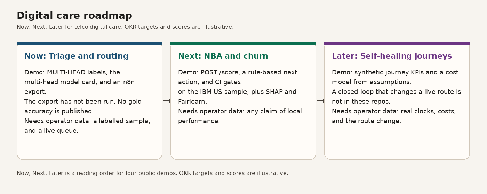
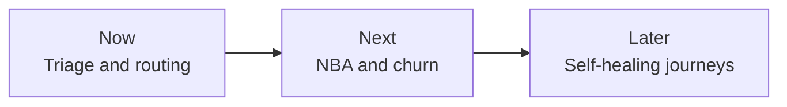
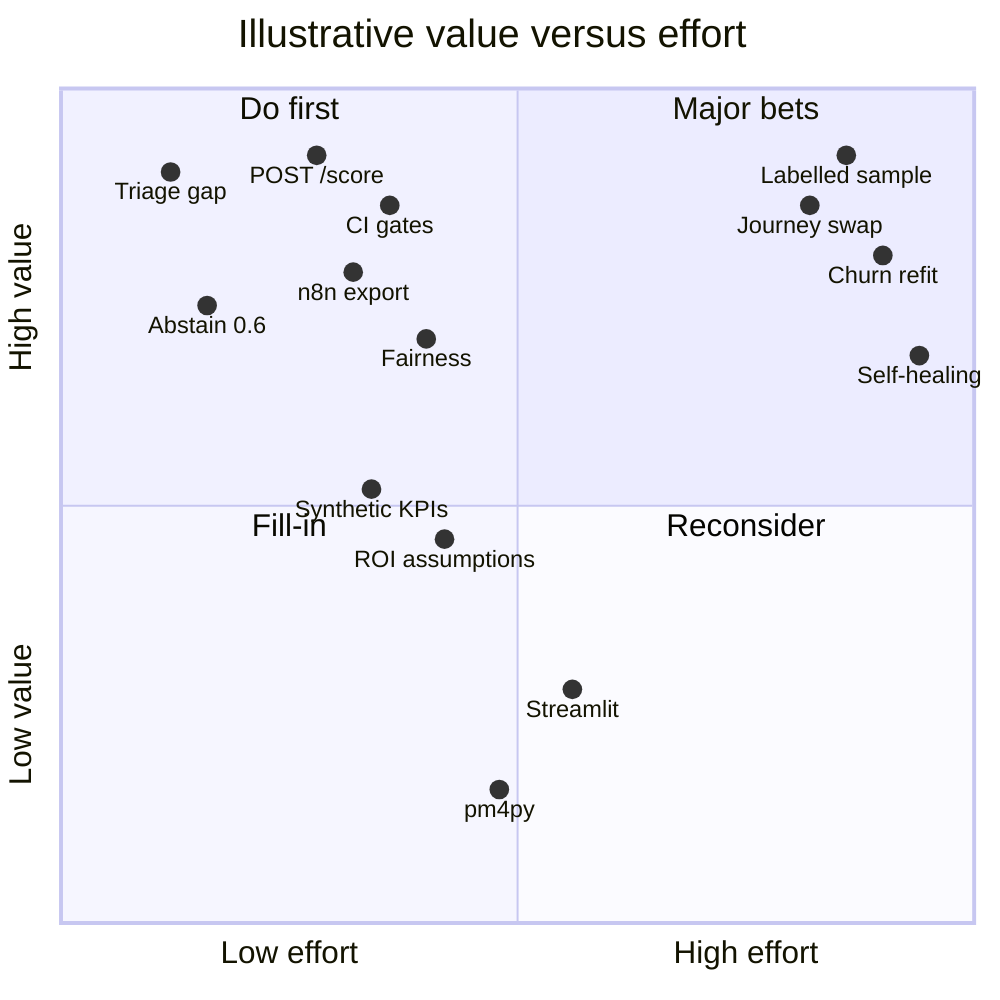

# Digital care roadmap

[](https://github.com/ChristopherKiokoStrathmore/digital-care-roadmap/actions/workflows/ci.yml)
[](https://www.python.org/downloads/release/python-3120/)
[](LICENSE)

Which care-analytics capability should a telco build first, and how would you know it worked?

A Now / Next / Later product roadmap that sequences the four earlier projects, with OKRs as goals and a value-versus-effort backlog of 17 issues (#3 to #19), two sprint plans and a pilot charter. Part of an independent portfolio series on telecom customer analytics, built alongside my MSc in Data Science. It builds on the CRISP-DM projects in the series.

## Projects in this series

- [telco-churn-nba-engine](https://github.com/ChristopherKiokoStrathmore/telco-churn-nba-engine)
- [responsible-ai-pack](https://github.com/ChristopherKiokoStrathmore/responsible-ai-pack)
- [omnichannel-care-analytics](https://github.com/ChristopherKiokoStrathmore/omnichannel-care-analytics)
- [care-automation-roi](https://github.com/ChristopherKiokoStrathmore/care-automation-roi)

## Run

Requires Python 3.12.

```bash
make install
make test
make render
```

`make install` installs the packages in `requirements.txt`. `make test` runs the unittest suite. `make render` writes `docs/roadmap.png`.

## Key results (capability and scope)

- 3 horizons: Now (triage and routing), Next (NBA and churn), Later (self-healing journeys).
- 17 backlog items (3 epics, 14 stories) scored on value vs effort, 1 to 5 scale.
- OKR targets and scores are illustrative planning values, not achieved results.

## Now, Next, Later



`scripts/render_roadmap.py` draws that image. The same sequence in text:



### Now - Triage and routing

Demo, today:

- [MULTI-HEAD-](https://github.com/ChristopherKiokoStrathmore/MULTI-HEAD-) at `809bccd61077898849c428f37521fa198f7c7bf6` is a three-head demo (issue, sentiment, urgency). Issue confidence strictly below 0.6 is held for review. The repo publishes no gold accuracy, F1, emergency recall, or false-emergency rate. Smoke floors `minEmergencyRecall` 0.01 and `maxFalseEmergencyRate` 0.99 are harness-health thresholds, not model quality. That reading is the one written in [responsible-ai-pack](https://github.com/ChristopherKiokoStrathmore/responsible-ai-pack) `MODEL_CARD_MULTIHEAD.md`.
- [care-automation-roi](https://github.com/ChristopherKiokoStrathmore/care-automation-roi) ships `workflows/n8n_emergency_escalation.json`. An `emergency` label sets `queue` to `senior_agent`. The workflow README says the file has not been imported or executed. `active` is `false`. Precision 0.40, recall 0.75, and prevalence 0.08 in `assumptions.yaml` are illustrative placeholders.

Needs operator data before this is anything but a demo: a labelled sample, and a workflow run against a real queue. Do not quote the smoke floors as accuracy.

### Next - NBA and churn

Demo, today:

- [telco-churn-nba-engine](https://github.com/ChristopherKiokoStrathmore/telco-churn-nba-engine) trains on the IBM Telco Customer Churn file, 7,043 rows, US sample. `POST /score` returns a churn probability, path contributions, a CLV proxy, add-on propensities, and a rule-based next action. On the published holdout the gradient-boosting churn model has ROC-AUC 0.846001, PR-AUC 0.656070, and top-decile lift 2.806733, against a dummy prior at ROC-AUC 0.500000. Those numbers are that holdout, not an operator result. Uptake scores are current add-on holding, not campaign response. The action table is a policy, not an uplift model.
- [responsible-ai-pack](https://github.com/ChristopherKiokoStrathmore/responsible-ai-pack) pins that repo at `21f6115931f4358ebc7cc87d9ba1f4d87fd015aa`. It recomputes the same three metrics, draws TreeSHAP plots, runs Fairlearn on gender and SeniorCitizen, and fails CI under floors 0.82, 0.63, and 2.60.

Needs operator data before anyone calls this local performance: an operator extract, a refit, and a new pin. The IBM metrics stay IBM metrics.

### Later - Self-healing journeys

What the demos actually are:

- [omnichannel-care-analytics](https://github.com/ChristopherKiokoStrathmore/omnichannel-care-analytics) computes journey KPIs on a seeded synthetic log (seed 20260929, 4,000 journeys). Charts are Plotly HTML labelled SYNTHETIC. Bitext supplies the intent taxonomy. The full Kaggle Twitter corpus was not downloaded: unauthenticated requests did not return the file, and no Kaggle credentials were used. pm4py is not used. The process view is a DuckDB directly-follows table.
- [care-automation-roi](https://github.com/ChristopherKiokoStrathmore/care-automation-roi) prices containment from `assumptions.yaml`. Every input is an illustrative placeholder. On those placeholders the base bot scenario shows payback 8.47 months and year-1 ROI 0.4175. There is no Streamlit app. The sensitivity chart is a committed PNG, `reports/charts/roi_sensitivity_tornado.png`, plus an HTML twin.

What is not built: a loop that changes a live route when a digital attempt fails. Later is that loop. The four repos do not contain it.

Needs operator data: replace `config/synthetic.yaml` and `assumptions.yaml` with operator measurements, using the swap steps those READMEs already print. Until then the rates and the payback stay synthetic or illustrative.

## OKRs

Illustrative targets. None of these is a result this portfolio has achieved on operator data.

**Objective 1. A routing note a reviewer can defend without a fake accuracy number.**

| Key result | Illustrative target | What the demos already show |
| --- | --- | --- |
| KR1 | The routing note cites "not documented" for gold accuracy, and does not cite the smoke floors as quality. | The multi-head model card already says this. |
| KR2 | An import test of the n8n file, on a non-production n8n, shows `emergency` to `senior_agent`. | The file exists. It has not been run. |
| KR3 | Precision and recall leave `assumptions.yaml` only after a labelled sample is written down. | They are still placeholders. |

**Objective 2. A next-best action with a gate in front of the score.**

| Key result | Illustrative target | What the demos already show |
| --- | --- | --- |
| KR1 | A pilot score returns churn probability, a CLV proxy, and one action from the published rule table. | `POST /score` does this for one IBM-sample customer. |
| KR2 | CI fails if holdout ROC-AUC, PR-AUC, or top-decile lift fall below 0.82, 0.63, and 2.60. | Those floors are in `gates.yaml` for the IBM artifact. |
| KR3 | A model card and the gender / SeniorCitizen table ship with the score before an agent sees it. | The pack has both, for the IBM sample only. |

**Objective 3. Journey changes follow an operator log, not a synthetic clock.**

| Key result | Illustrative target | What the demos already show |
| --- | --- | --- |
| KR1 | Time-to-first-response, repeat contact, and digital-to-call are computed on an operator log. | They are computed on the synthetic log only. |
| KR2 | Cost and containment inputs are replaced from operator sources, and the placeholder label comes off only after that swap. | The label is still on every input. |
| KR3 | A failed digital attempt changes the next route in a named pilot path. | No repo implements that change. |

## Backlog and prioritisation

Scores are illustrative planning scores for this artefact, on a 1-5 scale. They are not measured benefit and not hours. The quadrant is a reading aid for the backlog. Overlapping scores are nudged on the chart so the labels fit. The table is the score.

| Item | Issue | Value | Effort | Quadrant | Status |
| --- | --- | --- | --- | --- | --- |
| Triage quality gap | [#4](https://github.com/ChristopherKiokoStrathmore/digital-care-roadmap/issues/4) | 5 | 1 | Do first | Demo exists |
| Abstain at 0.6 | [#5](https://github.com/ChristopherKiokoStrathmore/digital-care-roadmap/issues/5) | 4 | 1 | Do first | Demo exists |
| n8n emergency branch | [#6](https://github.com/ChristopherKiokoStrathmore/digital-care-roadmap/issues/6) | 4 | 2 | Do first | Export, not run |
| POST /score | [#9](https://github.com/ChristopherKiokoStrathmore/digital-care-roadmap/issues/9) | 5 | 2 | Do first | Demo exists |
| CI gates | [#10](https://github.com/ChristopherKiokoStrathmore/digital-care-roadmap/issues/10) | 5 | 2 | Do first | Demo exists |
| Fairness table | [#11](https://github.com/ChristopherKiokoStrathmore/digital-care-roadmap/issues/11) | 4 | 2 | Do first | Demo exists |
| Synthetic journey KPIs | [#14](https://github.com/ChristopherKiokoStrathmore/digital-care-roadmap/issues/14) | 3 | 2 | Do first | Demo exists |
| Assumption ROI | [#15](https://github.com/ChristopherKiokoStrathmore/digital-care-roadmap/issues/15) | 3 | 2 | Do first | Demo exists |
| Labelled triage sample | [#7](https://github.com/ChristopherKiokoStrathmore/digital-care-roadmap/issues/7) | 5 | 5 | Major bet | Needs operator data |
| Operator churn refit | [#12](https://github.com/ChristopherKiokoStrathmore/digital-care-roadmap/issues/12) | 5 | 5 | Major bet | Needs operator data |
| Operator journey swap | [#16](https://github.com/ChristopherKiokoStrathmore/digital-care-roadmap/issues/16) | 5 | 5 | Major bet | Needs operator data |
| Self-healing loop | [#17](https://github.com/ChristopherKiokoStrathmore/digital-care-roadmap/issues/17) | 4 | 5 | Major bet | Not built |
| pm4py | [#18](https://github.com/ChristopherKiokoStrathmore/digital-care-roadmap/issues/18) | 1 | 3 | Reconsider | Declined in the journey README |
| Streamlit | [#19](https://github.com/ChristopherKiokoStrathmore/digital-care-roadmap/issues/19) | 2 | 3 | Reconsider | Declined in the ROI README |



Epics: [#3](https://github.com/ChristopherKiokoStrathmore/digital-care-roadmap/issues/3) triage, [#8](https://github.com/ChristopherKiokoStrathmore/digital-care-roadmap/issues/8) NBA and churn, [#13](https://github.com/ChristopherKiokoStrathmore/digital-care-roadmap/issues/13) self-healing journeys. The full sheet is [backlog.csv](backlog.csv).

## Pilot plan

Two sprint plans, with user stories and Given / When / Then criteria: [docs/sprint-plans.md](docs/sprint-plans.md).

Sprint 1 is the triage contract ([#4](https://github.com/ChristopherKiokoStrathmore/digital-care-roadmap/issues/4), [#5](https://github.com/ChristopherKiokoStrathmore/digital-care-roadmap/issues/5), [#6](https://github.com/ChristopherKiokoStrathmore/digital-care-roadmap/issues/6)). Sprint 2 is the NBA demo behind the published gates ([#9](https://github.com/ChristopherKiokoStrathmore/digital-care-roadmap/issues/9), [#10](https://github.com/ChristopherKiokoStrathmore/digital-care-roadmap/issues/10), [#11](https://github.com/ChristopherKiokoStrathmore/digital-care-roadmap/issues/11)). These sprints were not run.

Pilot / PoC charter template: [docs/pilot-charter.md](docs/pilot-charter.md).

## Backlog

The backlog lives in [GitHub Issues](https://github.com/ChristopherKiokoStrathmore/digital-care-roadmap/issues). A GitHub Projects board can be generated with [scripts/create_board.sh](scripts/create_board.sh). The script needs a token with project scope.

## Lessons learned

- I keep the churn train/test split leak-free. The split is drawn before imputation, scaling, encoding, or the survival curve, and preprocessing stays inside a pipeline so held-out rows cannot change what was learned.
- I fail the build in CI when the saved churn model's holdout ROC-AUC, PR-AUC, or top-decile lift falls below the floors in `gates.yaml` (0.82, 0.63, and 2.60 on the IBM artifact).
- I label synthetic data everywhere it appears, including the journey charts, so a reader can see that the log is synthetic.
- I keep illustrative inputs explicit in config. Cost and containment figures stay in `assumptions.yaml`, and the placeholder label stays on each one.
- I test README numbers against committed outputs, so a figure in the write-up has to match the file the run produced.

## Data and scope

Built on public and synthetic data as an independent portfolio project.

## Limitations

- This roadmap sequences public demos. It is not a production operating plan.
- Illustrative OKR targets and the 1-5 scores are planning labels in this repo. They are not measurements.
- Lessons learned are engineering notes from building the four demos. They are not operator results, and they do not add a metric.
- The closed loop in Later is not implemented.
- Projects 1-4 use the IBM US sample, a synthetic journey log, Bitext intent names, a short Twitter preview, and labelled cost assumptions. None of that is operator customer data.
- The backlog is the GitHub Issues list. A Projects board is produced by `scripts/create_board.sh` when it is run with a token that has project scope.
- This repo does not add a new model, a new dataset, or a new metric.
